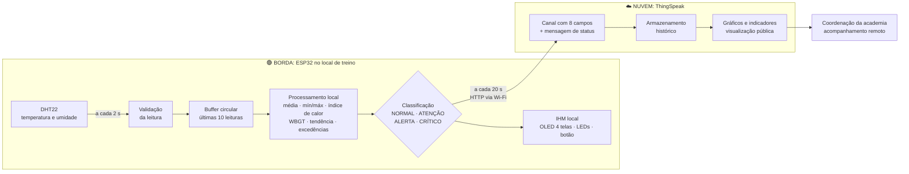

# Pelé Academia · Monitor Ambiental de Treino (Edge Computing)

> **FIAP · 1º ano de Engenharia de Software · Semipresencial RJ**
> Challenge Pelé Academia, Sprint 3: **Edge Computing & Computer Systems (ECCS)**

Um protótipo com **ESP32** que monitora a **temperatura e a umidade** dos espaços de treino da Pelé Academia. O próprio dispositivo **processa os dados na borda** (média móvel, limites, índice de calor, WBGT, tendência e classificação de risco) e mostra o resultado **na hora** numa IHM local (display OLED, LEDs e botão). Depois envia os dados já processados para a nuvem **ThingSpeak**, que guarda o histórico, gera os gráficos e permite o acompanhamento remoto.

---

## 🔗 Links da entrega

| Item | Link |
|---|---|
| Repositório GitHub (este) | <https://github.com/htxmetrics/pele-academia-edge-computing> |
| Projeto no Wokwi | <https://wokwi.com/projects/476150732716968961> |
| Canal público no ThingSpeak | <https://thingspeak.mathworks.com/channels/3458232> |

## 👥 Integrantes

| Nome completo | RM |
|---|---|
| _Nome do integrante_ | _RM00000_ |
| _Nome do integrante_ | _RM00000_ |

---

## 1. O problema: por que monitorar o ambiente de treino?

Treinar futebol no calor do Rio de Janeiro é arriscado. Temperatura alta **somada** a umidade alta impede que o suor evapore, e o corpo do atleta deixa de conseguir se resfriar. O resultado pode ser queda de rendimento, cãibras, exaustão e, no pior caso, **insolação**. Os atletas da Pelé Academia são, em grande parte, **crianças e adolescentes**, que regulam a temperatura do corpo pior que um adulto.

Hoje, a decisão de pausar ou suspender um treino depende da "sensação" do treinador. O protótipo troca essa sensação por um **número medido e uma regra clara**, visível ali no campo, sem depender de internet.

## 2. Visão geral da solução



## 3. O que acontece na borda × o que acontece na nuvem

Esse é o ponto central do projeto. **Tudo o que precisa de resposta imediata acontece no ESP32**, e a nuvem fica com o que é histórico e remoto.

| Operação | Onde | Por quê |
|---|---|---|
| Leitura periódica do DHT22 (a cada 2 s) | 🟢 **ESP32** | É o hardware local |
| Validação da leitura (descarta `NaN` e valores fora da faixa do sensor) | 🟢 **ESP32** | Evita que lixo chegue ao processamento e à nuvem |
| Buffer circular das últimas 10 leituras | 🟢 **ESP32** | Dá base para a média sem precisar da nuvem |
| **Média móvel** de temperatura e umidade | 🟢 **ESP32** | Suaviza ruído e picos isolados |
| **Mínimo e máximo** da janela | 🟢 **ESP32** | Mostra a variação recente |
| **Índice de calor** (sensação térmica, fórmula NOAA) | 🟢 **ESP32** | Traduz T + UR em algo que o treinador entende |
| **WBGT/IBUTG estimado** | 🟢 **ESP32** | Indicador usado no esporte para risco de calor |
| **Tendência** da temperatura (°C/min, regressão linear) | 🟢 **ESP32** | Avisa se o ambiente está esquentando |
| **Contagem de leituras acima dos limites** | 🟢 **ESP32** | Identifica valores acima dos limites estabelecidos |
| **Classificação do estado** e recomendação | 🟢 **ESP32** | A decisão não pode depender de internet |
| **IHM**: OLED, LEDs e botão | 🟢 **ESP32** | Informação imediata no campo |
| Reconexão automática do Wi-Fi (sem travar o loop) | 🟢 **ESP32** | O monitoramento continua mesmo offline |
| Envio dos dados já processados (HTTP GET) | 🟢→☁️ | Ponte entre borda e nuvem |
| **Armazenamento** do histórico | ☁️ **ThingSpeak** | Memória de longo prazo, que o ESP32 não tem |
| **Gráficos** de cada variável ao longo do tempo | ☁️ **ThingSpeak** | Análise visual do comportamento do ambiente |
| **Visualização pública** do canal | ☁️ **ThingSpeak** | Acompanhamento remoto por qualquer pessoa |
| Registro da **mensagem de status** de cada envio | ☁️ **ThingSpeak** | Linha do tempo dos alertas |
| Exportação dos dados (CSV/JSON/API) | ☁️ **ThingSpeak** | Integração com as outras disciplinas (Python, DPS, front-end) |

> **Resiliência:** se o Wi-Fi cair, o ESP32 continua lendo o sensor, processando, classificando e atualizando o OLED e os LEDs. Só o envio para a nuvem fica suspenso até a conexão voltar, e a tela 4 da IHM mostra "Modo local ativo".

## 4. Hardware

| Componente | Função | Ligação no ESP32 |
|---|---|---|
| ESP32 DevKit C v4 | Microcontrolador com Wi-Fi (dispositivo de borda) | — |
| DHT22 | Sensor de temperatura (−40 a 80 °C) e umidade (0 a 100 %) | VCC→3V3 · SDA→**GPIO15** · GND→GND |
| Display OLED SSD1306 128×64 (I2C) | IHM: valores, estado e recomendação | VCC→3V3 · SDA→**GPIO21** · SCL→**GPIO22** · GND→GND |
| LED verde + resistor 220 Ω | Estado NORMAL | **GPIO25** |
| LED amarelo + resistor 220 Ω | Estado ATENÇÃO (piscando = erro no sensor) | **GPIO26** |
| LED vermelho + resistor 220 Ω | ALERTA (aceso) / CRÍTICO (piscando) | **GPIO27** |
| Botão (push button) | Troca a tela do OLED | **GPIO4** (pull-up interno) → GND |

<!-- Coloque aqui um print do circuito no Wokwi: -->
<!--  -->

## 5. Processamento local em detalhe

### 5.1 Aquisição e validação
A cada **2 segundos** (intervalo mínimo do DHT22) o ESP32 lê temperatura e umidade. A leitura só é aceita se não for `NaN` e se estiver dentro da faixa física do sensor. Três falhas seguidas colocam o sistema em **ERRO SENSOR** (LED amarelo piscando), e esse estado não é enviado à nuvem.

### 5.2 Buffer circular e média móvel
As 10 últimas leituras válidas ficam num **buffer circular**: quando chega a 11ª, ela sobrescreve a mais antiga. Sobre essa janela (os últimos ~20 s) o ESP32 calcula:

- **média** de temperatura e de umidade;
- **mínimo e máximo** de temperatura;
- **excedências**: quantas leituras da janela ficaram acima de 32 °C, acima de 80 % UR ou abaixo de 30 % UR.

> A classificação usa a **média**, e não a leitura instantânea. Um pico isolado (ruído ou alguém encostando no sensor) não dispara um alerta falso.

### 5.3 Índice de calor (sensação térmica)
Calculado com a fórmula de Rothfusz/NOAA (função `computeHeatIndex` da biblioteca DHT) a partir da temperatura e da umidade médias.

### 5.4 WBGT (IBUTG) estimado
O **WBGT** (*Wet Bulb Globe Temperature*, em português **IBUTG**) é o índice que federações esportivas e a medicina do esporte usam para decidir pausas e suspensões por calor. Com só um sensor de temperatura e umidade dá para **estimar** o WBGT à sombra pela fórmula do *Australian Bureau of Meteorology*:

```
e    = (UR / 100) × 6,105 × exp(17,27 × T / (237,7 + T))      ← pressão de vapor (hPa)
WBGT = 0,567 × T + 0,393 × e + 3,94
```

> **Limitação:** a estimativa não considera radiação solar direta nem vento. Em campo aberto e sob sol forte, o WBGT real tende a ser **maior**. Para uso real, o ideal seria acrescentar um sensor de globo negro. Isso fica registrado como evolução futura.

### 5.5 Tendência (taxa de variação)
Por **regressão linear (mínimos quadrados)** sobre as leituras do buffer, o ESP32 calcula a **inclinação da temperatura em °C/min**, ou seja, a derivada do indicador ao longo do tempo (conceito trabalhado em DPS). No OLED ela aparece como *subindo*, *estável* ou *caindo*.

### 5.6 Critérios de atenção (regra de decisão)

| Estado | Condição (sobre as médias) | LEDs | Recomendação exibida |
|---|---|---|---|
| 🟢 **NORMAL** | WBGT < 25 °C e T/UR dentro dos limites | Verde | Treino liberado |
| 🟡 **ATENÇÃO** | 25 ≤ WBGT < 28 °C **ou** T > 32 °C **ou** UR > 80 % **ou** UR < 30 % | Amarelo | Pausas para hidratação |
| 🔴 **ALERTA** | 28 ≤ WBGT < 32 °C | Vermelho | Reduzir intensidade |
| 🔴 **CRÍTICO** | WBGT ≥ 32 °C | Vermelho piscando | Suspender treino |
| ⚠️ **ERRO SENSOR** | 3 leituras inválidas seguidas | Amarelo piscando | Verificar sensor |

**De onde vêm os limites:** as faixas de WBGT seguem a lógica das diretrizes de medicina do esporte para atividade física no calor (ACSM) e do protocolo da FIFA, que prevê **pausas de hidratação (*cooling breaks*) quando o WBGT passa de 32 °C**. Como o público é jovem, adotamos faixas conservadoras. Umidade abaixo de 30 % aumenta a desidratação e o desconforto respiratório, e acima de 80 % prejudica a evaporação do suor. Todos os limites são constantes no início do código e podem ser ajustados pela equipe técnica.

## 6. IHM local

O OLED alterna automaticamente entre **4 telas** a cada 6 s. O **botão** avança para a próxima tela na hora. Todas as telas mostram na parte de baixo uma **faixa com o estado atual**, e no canto superior os indicadores `W` (Wi-Fi conectado) e `C` (último envio à nuvem com sucesso há menos de 60 s).

| Tela | Conteúdo |
|---|---|
| 1 · **Principal** | Temperatura e umidade instantâneas (fonte grande), WBGT e tendência |
| 2 · **Médias locais** | Ocupação da janela (x/10), médias de T e UR, mín/máx |
| 3 · **Conforto térmico** | WBGT, sensação térmica, tendência em °C/min e recomendação para o treino |
| 4 · **Nuvem/Rede** | Estado do Wi-Fi, IP/RSSI, envios OK/falhas e tempo desde o último envio |

Os **LEDs** funcionam como um semáforo visível de longe pelo treinador, e o **Monitor Serial** registra cada ciclo de leitura e envio (útil para depuração e para a apresentação).

<!--  -->

## 7. Nuvem: canal ThingSpeak

A cada **20 s** (o plano gratuito aceita no mínimo 15 s entre envios) o ESP32 faz um `HTTP GET` em `api.thingspeak.com/update` com:

| Campo | Conteúdo | Origem |
|---|---|---|
| Field 1 | Temperatura instantânea (°C) | leitura |
| Field 2 | Umidade instantânea (%) | leitura |
| Field 3 | Temperatura média (°C) | **processado na borda** |
| Field 4 | Umidade média (%) | **processado na borda** |
| Field 5 | Índice de calor (°C) | **processado na borda** |
| Field 6 | WBGT estimado (°C) | **processado na borda** |
| Field 7 | Estado (0 Normal · 1 Atenção · 2 Alerta · 3 Crítico) | **processado na borda** |
| Field 8 | Leituras fora do limite na janela | **processado na borda** |
| Status | Texto, ex.: `ALERTA \| Reduzir intensidade \| exced 4/10` | **processado na borda** |

O passo a passo para criar e configurar o canal (campos, gráficos, indicadores e visualização pública) está em **[docs/thingspeak.md](docs/thingspeak.md)**.

<!--  -->

## 8. Como executar no Wokwi

1. Acesse o link do projeto no Wokwi (tabela de links acima) **ou** crie um projeto novo em <https://wokwi.com/projects/new/esp32>.
2. Se criou um projeto novo, copie o conteúdo de [`esp32/sketch.ino`](esp32/sketch.ino) e [`esp32/diagram.json`](esp32/diagram.json) para os arquivos de mesmo nome, e adicione as bibliotecas de [`esp32/libraries.txt`](esp32/libraries.txt) pelo **Library Manager**.
3. No `sketch.ino`, troque `COLOQUE_SUA_WRITE_API_KEY_AQUI` pela **Write API Key** do seu canal ThingSpeak.
4. Clique em ▶ **Start the simulation**.
5. Clique no **DHT22** durante a simulação e mova os controles de temperatura e umidade para testar os estados (veja a seção 9).
6. Clique no **botão azul (TELA)** para navegar pelas telas do OLED.

> No Wokwi o ESP32 se conecta à rede `Wokwi-GUEST` (sem senha). Numa placa física, troque `WIFI_SSID` e `WIFI_SENHA` pela rede do local e remova o parâmetro de canal em `WiFi.begin()`.

## 9. Testes realizados (cenários de treino)

Os valores foram ajustados manualmente no DHT22 do Wokwi. Como o estado usa a média das últimas 10 leituras, ele muda cerca de 10 a 20 s depois do ajuste, que é o comportamento esperado.

| # | Cenário simulado | T (°C) | UR (%) | WBGT est. (°C) | Estado esperado | LED |
|---|---|---|---|---|---|---|
| 1 | Manhã amena, campo sombreado | 22 | 55 | ≈ 22,1 | NORMAL | 🟢 |
| 2 | Ginásio morno durante o treino | 27 | 50 | ≈ 26,2 | ATENÇÃO | 🟡 |
| 3 | Tarde quente e seca | 33 | 40 | ≈ 30,5 | ALERTA | 🔴 |
| 4 | Onda de calor carioca (abafado) | 34 | 70 | ≈ 37,8 | CRÍTICO | 🔴 piscando |
| 5 | Inverno seco, manhã | 20 | 25 | ≈ 17,6 | ATENÇÃO (UR < 30 %) | 🟡 |
| 6 | Wi-Fi indisponível | qualquer | qualquer | — | Leitura, OLED e LEDs continuam; envio suspenso | — |

<!-- Coloque prints de cada cenário em docs/img/ e referencie aqui -->

## 10. Relação dos resultados com os ambientes de treino

- **Campos abertos (manhã × tarde):** no Rio, a mesma quadra pode estar em **NORMAL às 8 h** e em **ALERTA ou CRÍTICO às 14 h**. O histórico do ThingSpeak mostra em que horários o WBGT passa de 28 °C e ajuda a coordenação a **remanejar os treinos intensos para o começo da manhã ou o fim da tarde**.
- **Ginásios e salas fechadas:** a temperatura pode não ser extrema, mas a **umidade sobe durante o treino** (respiração e suor de dezenas de atletas). O campo 8 (excedências) e a tendência mostram esse acúmulo, e o sinal é **melhorar a ventilação** ou fazer pausas.
- **Dias secos de inverno:** umidade abaixo de 30 % gera ATENÇÃO mesmo com temperatura amena, porque a desidratação passa despercebida. A recomendação é **reforçar a hidratação**.
- **Categorias de base:** crianças e adolescentes são mais vulneráveis ao calor, e por isso os limites são conservadores. A comissão técnica pode usar o estado para ajustar **duração, intensidade e intervalos de hidratação** por categoria.
- **Peneiras:** avaliar um atleta em condição CRÍTICA distorce o desempenho. O registro do estado ambiental junto da avaliação torna a peneira **mais justa**.

## 11. Integração com o restante do Challenge

- **Front-end / Web Development:** a API pública de leitura do ThingSpeak (`/channels/<id>/feeds.json`) permite exibir no site da Pelé Academia um card "Condição do campo agora".
- **Python (CTWP):** os dados exportados em CSV podem ser processados pelo script do grupo, por exemplo para gerar um relatório de horários mais seguros.
- **DPS:** a série de WBGT é um bom candidato para os conceitos de limite, derivada (a tendência já é calculada na borda) e integral (tempo acumulado em estado de risco).

## 12. Estrutura do repositório

```
.
├── README.md               ← este documento
├── PROMPTS.md              ← prompts de IA generativa utilizados
├── integrantes.txt         ← nomes e RMs
├── esp32/
│   ├── sketch.ino          ← código-fonte do ESP32
│   ├── diagram.json        ← circuito do Wokwi
│   └── libraries.txt       ← bibliotecas do Wokwi
└── docs/
    ├── thingspeak.md       ← configuração do canal ThingSpeak
    └── img/                ← prints (circuito, IHM, gráficos)
```

## 13. Próximos passos (Sprint 4)

- Integração com o **Blynk** para painel remoto e comandos.
- **Buzzer** para alerta sonoro no estado CRÍTICO, com a decisão tomada no ESP32 sem depender da nuvem.
- **Fila local** para guardar leituras enquanto o Wi-Fi estiver fora e enviá-las quando a conexão voltar.
- Sensor de **luminosidade** para checar a iluminação em treinos noturnos.
